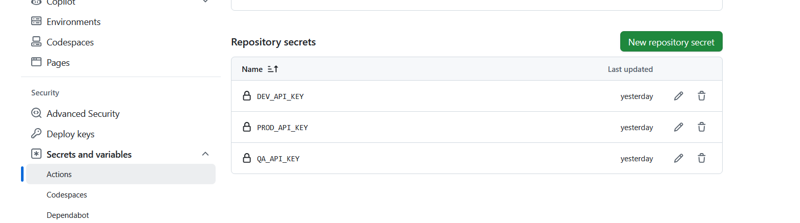

# challenge-ci-cd-github

## Overview

Welcome to the **challenge-ci-cd-github** repository! This project demonstrates the implementation of Continuous Integration (CI) and Continuous Deployment (CD) workflows using GitHub Actions. It is designed to automate the testing and deployment processes for Python applications, ensuring efficient and reliable software delivery.

## 🚀 Features

- **CI/CD Automation**: Seamless integration and deployment pipelines powered by GitHub Actions.
- **Python Testing**: Automated testing with frameworks like `pytest` to ensure code quality.
- **Deployment**: Streamlined deployment process to your chosen environment.

## ⚙️ Project Structure

The repository is organized as follows:

```
├── .github/
│   └── workflows/
│       └── ci-cd.yml           # GitHub Actions workflow configuration
├── app/                         # Application source code
├── build/                       # Build artifacts
├── dist/                        # Distribution packages
├── tests/                       # Unit and integration tests
├── .gitignore                   # Git ignore rules
├── requirements.txt             # Python dependencies
└── README.md                    # Project documentation
```

## 📦 Requirements

Ensure you have the following installed:

- Python 3.x
- `pip` (Python package installer)

Install the project dependencies:

```bash
pip install -r requirements.txt
```

## 🧪 Running Tests

To run the automated tests locally:

```bash
pytest tests/
```

## 🚀 Deployment

The deployment process is automated via GitHub Actions. Upon pushing changes to the main branch, the CI/CD pipeline will:

1. Run tests to verify code integrity.
2. Deploy the application to the specified environment.

This project is also deployed on **Streamlit Cloud**:

- **Production (main)**: [challenge-ci-cd-github ∙ main ∙ app/main.py](https://challenge-ci-cd-app-main.streamlit.app/)
- **QA (qa)**: [challenge-ci-cd-github ∙ qa ∙ app/main.py](https://challenge-ci-cd-app-quality-assurance.streamlit.app/)
- **Development (dev)**: [challenge-ci-cd-github ∙ dev ∙ app/main.py](https://challenge-ci-cd-app-dev.streamlit.app/)

## 🔧 Customizing Workflows

The CI/CD workflows are defined in `.github/workflows/ci-cd.yml`. You can customize the pipeline by modifying this file to suit your specific deployment needs.

## Visuals

CD in main will request approval from the reviewer to deploy the app:


CI runs only in main branch, production and triggered through pull requests from other branches:


Testing is done through pytest:


Once deployed, log message appears:


Environment has been set-up:



Both APP_ENV and APP_KEY have been provided in Streamlit Cloud.
